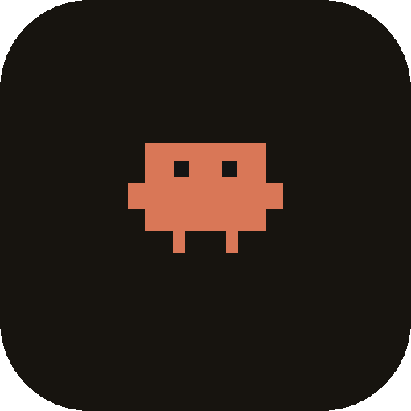
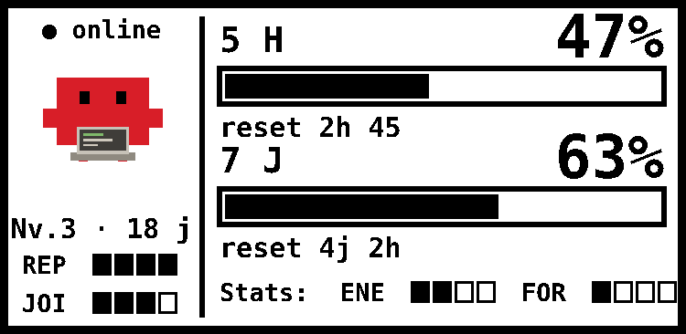
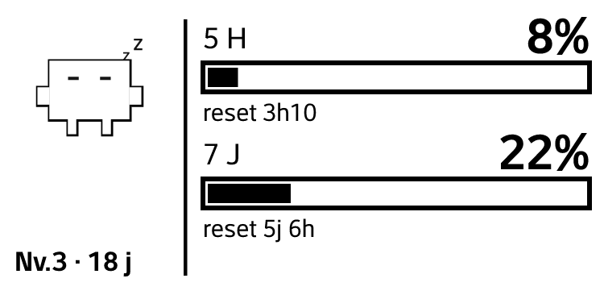
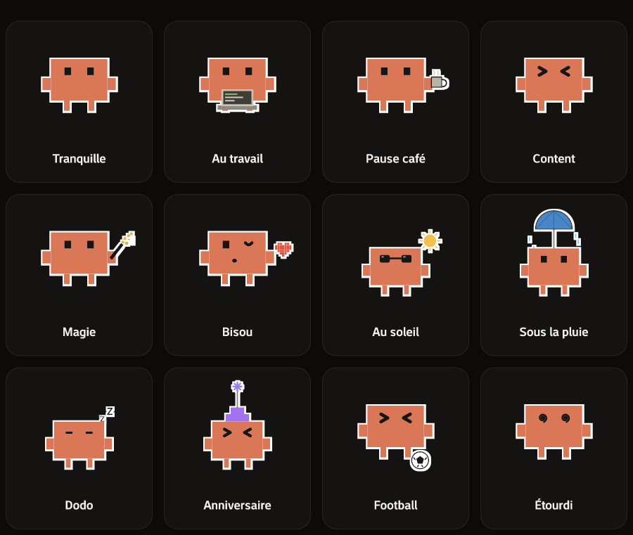
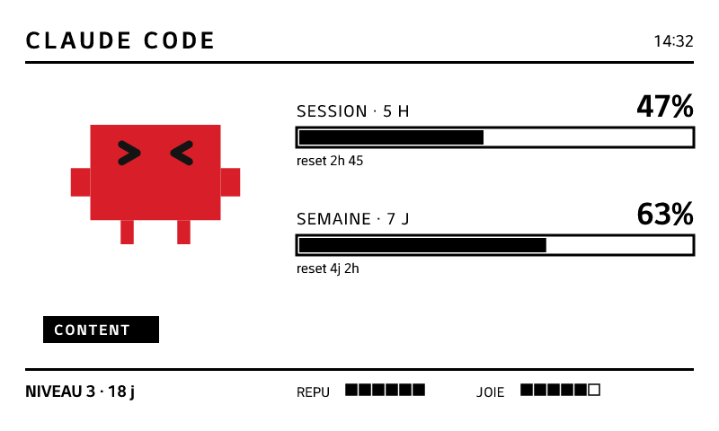

<div align="center">



# Claude e-paper

**Les limites de ton compte Claude Code, affichées par _Clawd_ la mascotte — sur ton navigateur et sur un écran e-paper de Raspberry Pi.**


<br/>

<em>Le rendu sur écran e-paper 2.13" — noir/blanc/rouge ou noir & blanc :</em>




</div>

---

## 🐾 C'est quoi ?

**Claude e-paper** récupère l'état de ton forfait **Claude Code** (fenêtres de limite 5 h et 7 j) et l'affiche de deux façons :

- un **dashboard web** installable (PWA) ;
- une **image e-paper** prête à être poussée sur un écran e-ink de Raspberry Pi.

Le tout est incarné par **Clawd**, la mascotte crabe de Claude Code, qui change d'humeur et d'activité selon l'heure, ton activité et même ton anniversaire. C'est un mélange de tableau de bord et de **Tamagotchi**.

## ✨ Fonctionnalités

- 📊 **Vraies limites** — interroge le même endpoint que la commande `/usage` de Claude Code (fenêtres 5 h & 7 j, heures de reset).
- 🦀 **Clawd, la mascotte** — une douzaine de poses (au travail, pause café le matin, dodo la nuit, anniversaire, bisou, au soleil, sous la pluie…), qui **tournent au fil de la journée**.
- 🎮 **Stats Tamagotchi** — Énergie, Forme, Repu, Bonheur + un **niveau** qui monte avec le temps *et* avec ton usage.
- 🖥️ **Rendu e-paper** — génère le PNG exact de la dalle (noir & blanc **ou** noir/blanc/rouge), via `GET /api/render.png`.
- 🌐 **Dashboard web + PWA** — jauges, personnage animé, page de config, installable avec icône.
- 🐳 **Docker / CasaOS** — image multi-stage prête à déployer.

## 🦀 Clawd & ses humeurs

<div align="center"></div>

Clawd ne se contente pas d'afficher un pourcentage : il **vit**. Sa pose est
choisie automatiquement selon le contexte (jamais selon le stress de la limite) :

- 🔄 **Rotation** — il change de pose au fil de la journée (intervalle réglable).
- ☕ **Pause café** — uniquement le matin.
- 😴 **Dodo** — la nuit, ou après un moment sans activité.
- 🎂 **Anniversaire** — la pose spéciale le jour J (date en config).
- ☀️/☔ **Au soleil / sous la pluie**, 😘 **bisou**, 🪄 **magie**… au gré de la rotation.

Chaque pose existe en **version couleur** (écran) et en **version noir & blanc**
distincte — un vrai line-art pour l'e-ink, pas une simple désaturation.

## 📐 Deux formats d'écran

Le rendu s'adapte à la taille de ta dalle (`epaperLayout` en config) :

**Compact — 2.13" (250×122)** _(voir le hero en haut)_ : Clawd, les jauges 5 h / 7 j
et des mini-stats Tamagotchi (Énergie, Repu, Joie).

**Grand — 7.5" (800×480)** : la version détaillée, avec stats complètes.

<div align="center"></div>

## 🧩 Comment ça marche

La page `/usage` de Claude appelle un endpoint OAuth ; l'app fait la même chose :

```http
GET https://api.anthropic.com/api/oauth/usage
Authorization: Bearer <access_token>
anthropic-beta: oauth-2025-04-20
```

Elle réutilise le **token OAuth déjà présent** sur la machine (celui de Claude Code, lu depuis `~/.claude/.credentials.json` ou le trousseau macOS), le rafraîchit automatiquement, met en cache le résultat et le diffuse en temps réel (SSE) au dashboard et au moteur de rendu.

> [!WARNING]
> Cet endpoint **n'est pas une API publique documentée**. Réutiliser le token OAuth de Claude Code dans un outil tiers se situe en zone grise vis-à-vis des CGU d'Anthropic. Projet **personnel**, à utiliser à tes risques.

## 🛠️ Matériel

Cible de référence de ce projet :

- **Raspberry Pi Zero 2 W** (OS 64-bit) — quad-core ARMv8, compatible Node moderne + Docker.
- **Waveshare 2.13-inch e-Paper HAT** branché sur les broches GPIO (SPI).

> Le rendu par défaut vise une grande dalle (800×480). Un **layout compact optimisé pour le 2.13"** (250×122) est au programme — voir la [roadmap](ROADMAP.md).

## 🚀 Démarrage rapide

```bash
git clone git@github.com:Vincweb/claude-epaper.git
cd claude-epaper
npm install
npm run dev          # web (Vite) + API sur :8787
```

Ouvre le dashboard, puis **⚙︎ Config → Importer les credentials**. Sans credentials, l'app démarre en **mode démo** (curseurs).

## 🐳 Docker / CasaOS

Le Pi Zero 2 W est lent à builder. On **construit les images ici** (Mac/CI) et on les pousse sur **Docker Hub** ; **le Pi ne fait plus que `pull`**.

**1. Sur ta machine — build + push** (il faut être connecté : `docker login`) :

```bash
./scripts/build-and-push.sh                    # Docker Hub, arm64, tag latest
```

> Pour utiliser GHCR à la place : `IMAGE_PREFIX=ghcr.io/vincweb ./scripts/build-and-push.sh`.

Ça build **deux** images multi-arch et les pousse : `claude-epaper` (app) et `claude-epaper-push` (boucle e-paper).

**2. Sur le Pi (ou CasaOS) — juste tirer et lancer** :

```bash
docker compose pull
docker compose up -d
```

Le dashboard est sur le port **8787**. Deux services tournent : l'**app** et la **boucle push e-paper** (voir ci-dessous).

> Si tu n'as pas de dalle (NAS/CasaOS seul), lance uniquement l'app : `docker compose up -d claude-epaper`.

## 🖥️ Brancher l'e-paper

Le service `epaper-push` du compose tire `/api/render.png` à cadence rapide mais **ne touche la dalle que si l'image a changé**. À la façon de [Bjorn](https://github.com/infinition/Bjorn) :

- **refresh partiel** à chaque changement (rapide, sans clignotement) sur les dalles monochromes qui le supportent ;
- **refresh complet périodique** (tous les `FULL_REFRESH_EVERY` partiels ou toutes les `FULL_REFRESH_SECONDS`) pour effacer le ghosting ;
- les dalles 3 couleurs (noir/blanc/rouge) retombent automatiquement sur le refresh complet.

**Sur le Pi :**

1. Active SPI : `sudo raspi-config` → *Interface* → *SPI*.
2. Ajuste `EPD_MODEL` (et les cadences) dans le `docker-compose.yml`, puis `docker compose up -d`.

Le compose passe déjà `/dev/spidev0.0` et `/dev/gpiochip0` au conteneur. Réglages (env du service `epaper-push`) :

| Variable | Défaut | Rôle |
|---|---|---|
| `RENDER_URL` | `http://claude-epaper:8787/api/render.png` | URL du PNG (nom de service compose) |
| `EPD_MODEL` | `epd2in13_V4` | module `waveshare_epd` de ta dalle |
| `POLL_SECONDS` | `30` | intervalle de tirage |
| `FULL_REFRESH_EVERY` | `30` | refresh complet tous les N partiels |
| `FULL_REFRESH_SECONDS` | `3600` | refresh complet au moins toutes les X s |

### Alternative : sans Docker (natif + systemd)

Si tu préfères lancer la boucle directement sur l'hôte (l'app pouvant tourner ailleurs) :

```bash
pip install requests pillow                 # + la lib Waveshare (waveshare_epd)
RENDER_URL=http://<hote>:8787/api/render.png python3 scripts/epaper_push.py
```

Pour un démarrage au boot, installe le service fourni ([scripts/epaper-push.service](scripts/epaper-push.service)) — adapte `User`, chemins et variables :

```bash
sudo cp scripts/epaper-push.service /etc/systemd/system/
sudo systemctl daemon-reload
sudo systemctl enable --now epaper-push.service
journalctl -u epaper-push.service -f        # logs (refresh partiel/complet)
```

## 📁 Structure

```
server/   API Node/TS : credentials + refresh + fetch usage + SSE + rendu PNG (resvg)
web/      Dashboard React/TS + Tailwind (jauges, Clawd animé, stats, config, PWA)
docs/     Visuels du README
scripts/  gen-assets.mjs · epaper_push.py (boucle e-paper) · build-and-push.sh (GHCR)
          epaper-push.Dockerfile · epaper-push.service (systemd)
Dockerfile · docker-compose.yml   déploiement 2 services (app + push) CasaOS / Pi
```

## 🗺️ Roadmap

Ce qui est prévu / en réflexion : **[ROADMAP.md](ROADMAP.md)**.

## 🙏 Crédits & mentions

- **Clawd** est la mascotte de Claude Code (Anthropic). Ce projet en propose une reconstruction pixel-art open source.
- Présentation inspirée du projet [Bjorn](https://github.com/infinition/Bjorn).
- Projet personnel, non affilié à Anthropic.

## 📄 Licence

[MIT](LICENSE).
